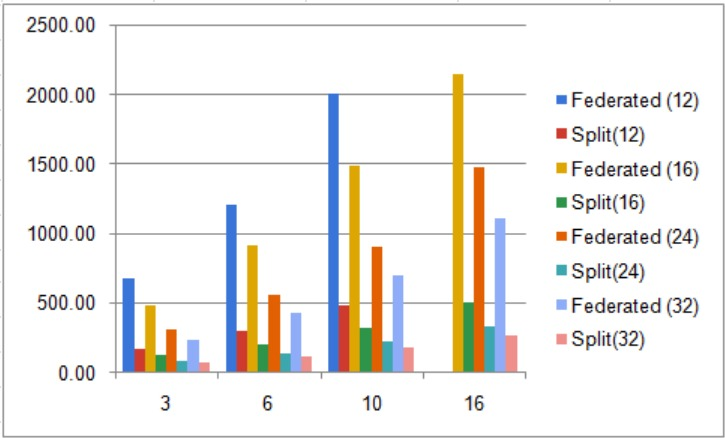

# Credit-card-fraud-detection-using-Federated-Learning-and-Split-Learning

In this project, we show a comparison between Federated Learning and Split Learning for credit card fraud detection dataset.

Dataset link: [kaggle.com/mlg-ulb/creditcardfraud](https://www.kaggle.com/mlg-ulb/creditcardfraud)

This dataset has been processed, split into train and test, and it was used for training, testing, and comparison. Smote1.ipynb is to generate somte file for the dataset.

## Required Files:
#### Download dataset from below links
   [creditcard_train_SMOTE_1.csv](https://drive.google.com/file/d/1vEFjrA5I08dVPEslMVixJG0Kjl9bW44V/view?usp=sharing)

   [creditcard_test.csv](https://drive.google.com/file/d/1rJlgEOpakousK-83fKKNg9xrjfPvU8sf/view?usp=sharing)

   [creditcard_train.csv](https://drive.google.com/file/d/1nnRE2v7J-zt5xyR9dy9QCwE1cShkDKH9/view?usp=sharing)

## How to perform Experiment
    Step 1: Download the dataset from the above links.

    Step 2: Open Fed_Split_Learning.ipynb. Run all the cells above "Federated Learning" section.

    Step 3: In the Federated Learning section, chnage the value of "num_clients" variable, which decides the dataset split size. It should be the number that can divide the dataset length. (ex. 32,24,16,12)

    Step 4: Change the variable "num_selected", which decides the number of bank clients. It should be less than "num_clients" variable. 

    Step 5: Add dataset to the drive, and replace the path for training and testing file(Variable "traindata" and "test_file"). This should be according to your drive path. Train file for balanced dataset should be of "creditcard_train_SMOTE_1.csv", and for imbalanced dataset it should be of "creditcard_train.csv". For test data, the path should be of "creditcard_test.csv".

    Step 6: Run all the cells of "Federated Learning". It will store the results in "mp" variable.

    Step 7: Now, run the whole "Federated Learning" section by changing number of clients by changing variable "num_selected". This should be done with the same dataset split.

    Step 8: Run the whole "Regular Learning" section. It does not have nuber of clients, so run it just one time. Results will be stored inside "mp" variable.

    Step 9: Now, run the "Split Learning" section by keeping the same "num_clients". Do change datset file name according to your need(Refer step 4). Run it multiple times by changing variable "num_selected", and store the results in mp. 

    Step 10: Run the first cell of "Graphs" section's sub-section "Separate graphs for each dataset split". It will save the JSON file of ypur results. Change the variable "i" to the value of "num_clients"(Should be same in both Federated and Split Learning).

    Step 11: We have executed the code for dataset split of 32, 24, 16, 12. Each will have clients 3,6,10,16 (Except for the dataset split 12, it will only have 3,6,10 clients' result).

    Step 12: This will leave you with 32_results.json, 24_results.json, 16_results.json, 12_results.json. For seperate graph, pick the data from any of the json file. You can execute the "Separate graphs for each dataset split" for multiple times to view yur results.

    Step 13: For all the combined result, run the "Graphs for combined results" sub-section of section "Graphs". This should be executed one time only to get ypur results. Make sure JSON files generated previously should be accessible to it.

## Results

### Accuracy

### Turnaround Time for Execution

